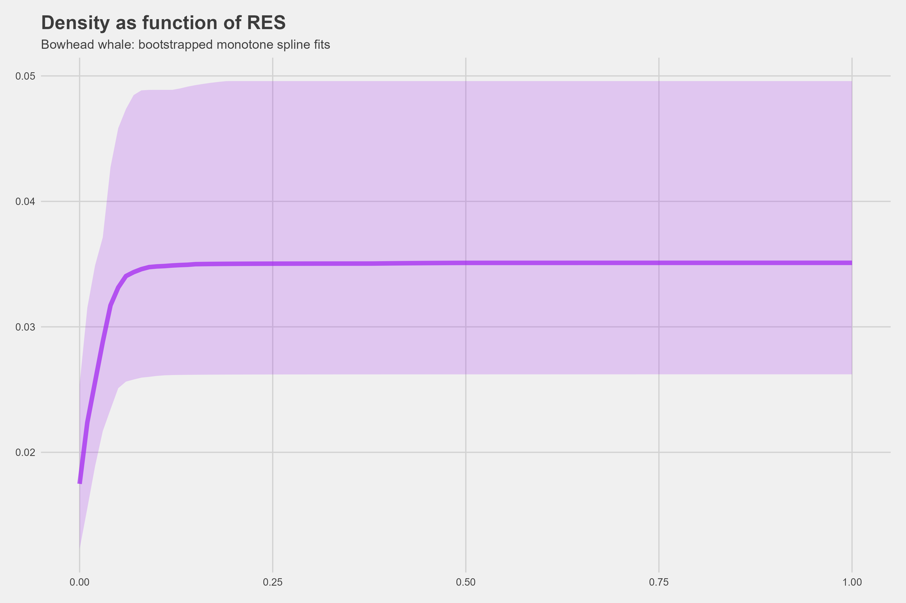

# Density calibration for the Relative Environmental Suitability (RES) index

This repository contains code relating to a SMRU Consulting project to derive predicted density surfaces from an index within AquaMaps. The index (RES) is from niche modelling, whereby simple envelopes/functions are derived from examination of literature and expert opinion. These are thought to represent the theoretically suitable areas on the globe for species, based on a few predictors. This is 0-1 bounded, with higher values for greater suitability. Details can be found here, and in the associated project report - components of which are paraphrased below. Refer to the full project report for details, including discussion and limitations.

## Modelling 

The AquaMaps RES index is a globally defined index at 0.5 x 0.5 degree grid cell resolution, ranging from values of 0 to 1. It is based on simple relationships with a few generally important predictors of species abundance and is further subject to expert scrutiny which bounds the RES surfaces based on known species’ extents, i.e. RES is set to zero where species are not thought to occur. It is also important to note that AquaMaps RES surfaces provide an annual average and do not vary seasonally/temporally.

The goal of the project is to provide species density maps with broader coverage than can be provided by species surveys alone, by seeking relationship between the RES index and species density. This requires estimation of a functional relationship between RES and observed abundances/densities. For 12 of the 15 species of interest, sources were identified that provided estimates of abundance or density which could be calibrated against the RES. Three of the species did not have spatially explicit estimates of density or abundance and were treated differently as described below.

### Spatially explicit density estimates

When modelling the functional relationship between the RES index and species density for 12 of the 15 priority species, two primary assumptions were made - RES values of zero roughly correspond to densities of zero, and that there is some form of increasing relationship between these two metrics. The first of these assumptions will be broadly correct, as expert review places boundaries on RES based on species ranges. The second is justified from the theoretical underpinnings of the RES, although the modelling applied will permit no relationship. 
Density estimates and their uncertainty were derived through a combination of monotonic spline regression and bootstrapping. The fundamental model fitted was a Generalised Additive Model (GAM, (Wood, 2011) with an increasing monotonic spline basis and with complexity determined through objective measures. Models were fitted using the scam package (Pya, 2022) with identity link, Normal errors and without intercept, noting that inference beyond the spline fits are via bootstrapping. 

Surveys provided density information and uncertainty in a number of forms, e.g. density survey maps, regional abundance estimates, and associated uncertainties as 95% Confidence Intervals (CI), Coefficient of Variation (CV), or Standard Errors (SE). A common treatment was applied to the data as a basis for bootstrapping. All survey information was expressed as densities (animals/km2) and uncertainties as standard errors. Surveys sometimes had multiple expressions of uncertainty e.g., SE and 95% CIs, in which case confidence intervals were preferred, with other standard error related measures used secondarily. In all cases standard errors were determined, under the assumption of log-Normally distributed errors where needed.
Bootstrapping was conducted at a survey level – each survey was represented as an estimate and SE, which, when defined, draws from a log-Normal distribution. One draw was taken from each of these survey distributions, then combined with the corresponding spatial set of RES values, and the monotonic GAM fitted. Typically, the relationship between density and RES is not strong, and had substantial uncertainty, as reflected in the slight trend lines with wide confidence envelopes. 

 

Example bootstrapped fits of density to RES for bowhead whales.

The required model outputs are predicted densities and CVs. Density predictions for all required 0.5 x 0.5 degree grid cells follow directly from the fitted function of RES, with CVs derived from the bootstraps, i.e. for a given RES, the bootstrap standard error was used. RES/predicted density values of 0 are given an undefined CV (null).

### Stock assessment abundance estimates

Three of the 15 species did not have spatial surveys available, only stock assessment abundance estimates (harp, hooded and northern elephant seals). In these cases, an explicit spatial link between a RES value and observed density was not possible, so the approach was to define a bounding region for the population and then use the RES surface to define a probability distribution for apportioning the abundance estimate over space. Specifically, the RES data were gathered within the species bounding box and then normalised. These were then multiplied by the population size estimate to give densities. Uncertainty for a single abundance estimate was propagated over space simply, as the abundance level CV applied equally. In cases requiring the combining of multiple stock abundance estimates (harp and hooded seals), this was addressed by summing bootstrap samples from each estimate’s distribution, with the mean and SE of this bootstrap distribution of summed abundances providing the CV.
